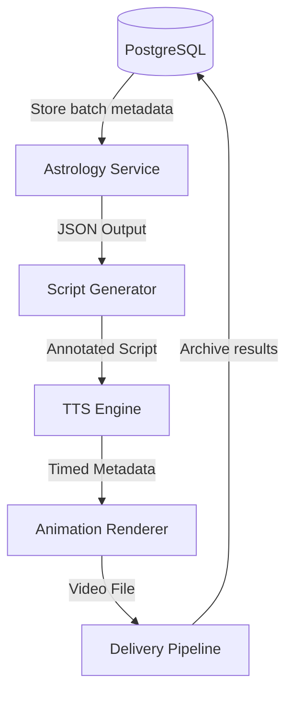

# AstroToon Service Architecture

## Core Components


## Docker Configuration
```yaml
version: '3.9'
services:
  astrology:
    build: 
      context: ./planets
      dockerfile: Dockerfile
    volumes:
      - ./planets/planet-alignments:/output
    environment:
      - OBSERVER_LAT=18.5392
      - OBSERVER_LON=-72.3363

volumes:
  planet-alignments:
```

## Dependency Management
### Poetry Configuration
```toml
[tool.poetry.dependencies]
python = "^3.10"
pydantic = "^2.7"
loguru = "^0.7"
```

### Version Pinning
```bash
# Planets service requirements
skyfield==1.53
numpy==2.2.5
```

## Data Flow
1. Astrology Service generates planetary positions
2. Script Generator creates annotated screenplay
3. TTS Engine produces timed phoneme metadata
4. Animation System renders final video