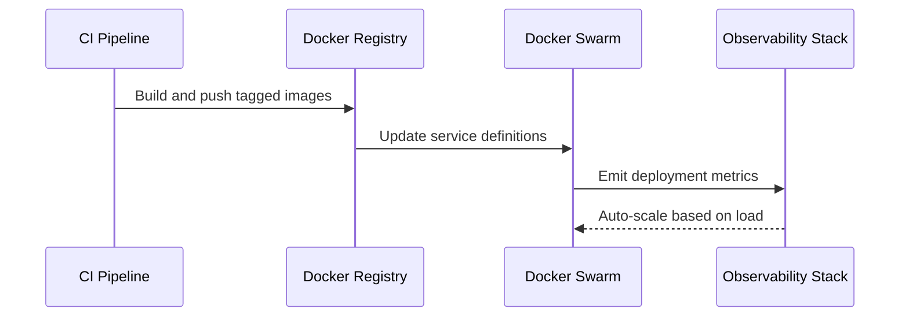

# AstroToon Deployment Strategy

## Container Orchestration


## Environment Variables
```yaml
# Required for astronomy service
OBSERVER_LAT: 18.5392  
OBSERVER_LON: -72.3363
TZ: America/Port-au-Prince
EPHEMERIS_DATA: /usr/share/astrodata
```

## Volume Management
```bash
# Create named volume for planetary data
docker volume create --driver local \
  --opt type=none \
  --opt device=/mnt/astro-volumes \
  --opt o=bind planet-alignments
```

## Monitoring Setup
```yaml
# docker-compose additions
services:
  prometheus:
    image: prom/prometheus:v2.47.2
    volumes:
      - ./monitoring/prometheus.yml:/etc/prometheus/prometheus.yml
    ports:
      - "9090:9090"

  grafana:
    image: grafana/grafana-enterprise:10.1.5
    volumes:
      - grafana-data:/var/lib/grafana
    ports:
      - "3000:3000"