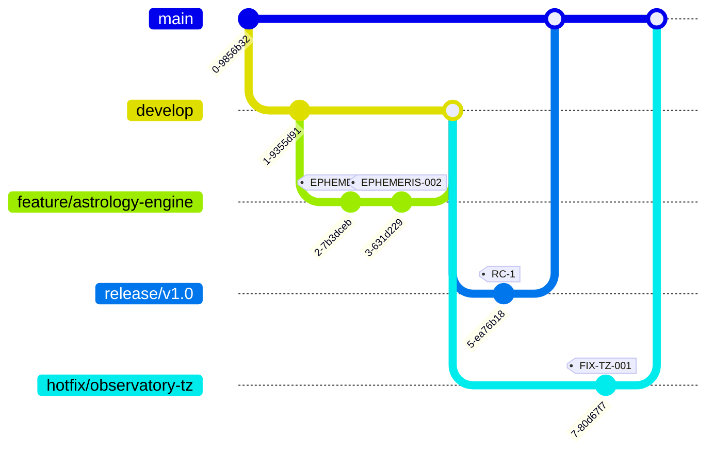

# AstroToon Git Management

## Branch Strategy


## Core Policies
### Branch Types
| Type     | Naming Convention    | Protection Rules                 |
|----------|----------------------|-----------------------------------|
| Main     | `main`               | Require 2 approvals              |
| Develop  | `develop`            | Require CI pass                  |
| Feature  | `feature/[epic]-[id]`| Squash merge only                |
| Hotfix   | `hotfix/[system]-[id]`| Block main merges during fixes  |

### Commit Standards
```bash
[EPHEMERIS-001] feat(astrology): Add lunar node calculations 
[FIX-TZ-002] fix(scheduler): Handle daylight saving transitions
[CONFIG-003] chore: Update poetry dependencies
```

## Code Review Requirements
1. All PRs must reference a PLAN.md section
2. Dockerfile changes require security review
3. Poetry dependency updates need version pinning
4. Animation templates require visual diff approval

## Monorepo Structure
```
services/
  planets/
    src/
    tests/
    pyproject.toml
  animation/
    templates/
    renderers/
  tts/
    processors/
    voicebanks/