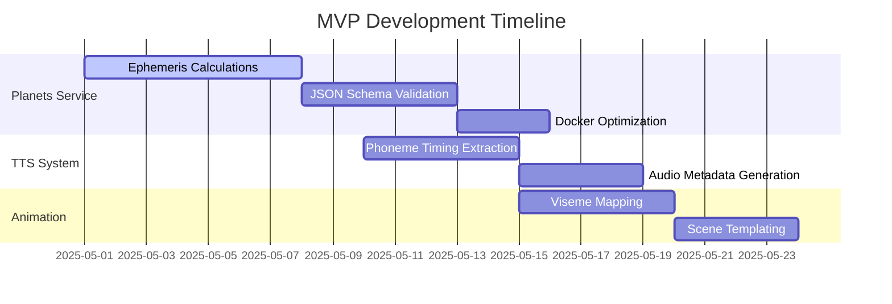
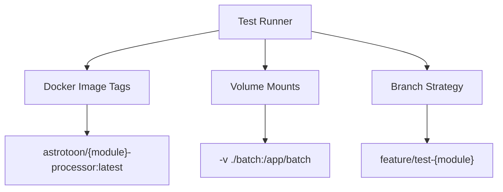

# AstroToon Task Breakdown

## Core Services Implementation



## Implementation Tasks

### 1. Astrological Engine (`planets/`)
- [ ] Implement Placidus house system calculations
- [ ] Add ephemeris data validation checks
- [ ] Create Docker multi-stage build configuration
- [ ] Write pytest cases for coordinate conversions
- [ ] Develop hourly calculation scheduler (Celery/RQ)
- [ ] Add container healthcheck endpoints

### 2. Script Generation (`ollama-script/`)
- [ ] Develop LLM prompt engineering framework
- [ ] Implement SFX/TTS tag parsing system
- [ ] Create template validation tests
- [ ] Add prompt versioning system
- [ ] Implement response quality metrics

### 3. Animation Pipeline (`animation/`)
- [ ] Develop viseme-to-mouthshape mapping
- [ ] Implement GSAP animation timeline builder
- [ ] Create automated video capture system
- [ ] Add frame-accurate synchronization tests
- [ ] Develop animation preview system

### 4. Integration Tasks
- [ ] Create end-to-end test scenarios
- [ ] Implement service handshake verification
- [ ] Develop performance monitoring dashboard

## Team Prompts

### Test System Implementation


#### Coder Tasks:
1. **Docker Image Standardization**
   Update all Dockerfiles to implement tagging convention per [PLAN.md#L117](PLAN.md)
   - Reference: [ARCHITECTURE.md#container-naming](ARCHITECTURE.md)
   
2. **Volume Mount Implementation**
   Add batch processing mounts in test_runner.ps1 following [planets/test_batch.py](planets/tests/test_batch.py)
   
3. **Git Workflow Enforcement**
   Create `test/planets-integration` branch following [GIT_STRATEGY.md#2.3](GIT_STRATEGY.md)

#### Researcher Tasks:
1. **Terminal Error Analysis**
   Investigate VSCode integration issues comparing [planets/Dockerfile.test](planets/Dockerfile.test) vs [animation/Dockerfile](animation/Dockerfile)

2. **Performance Optimization**
   Analyze test timing data before/after Docker changes per [ARCHITECTURE.md#parallel-execution](ARCHITECTURE.md)

3. **Dependency Mapping**
   Generate cross-module graph using pyreverse, store in [docs/dependency_graph.png](docs/dependency_graph.png)

### Developer Implementation Guide
```markdown
### Containerized Astronomy Service
**Requirements:**
1. Implement Celery beat scheduler for hourly calculations
2. Add healthcheck endpoint at `/health` returning:
   ```json
   {"status": "ok", "last_calculation": "2025-05-05T22:00:00Z"}
   ```
3. Ensure Skyfield 1.53 compatibility in Docker build
4. Reference: [Architecture Docs](ARCHITECTURE.md#service-containerization)

### Animation Synchronization
**Requirements:**
1. Implement frame-accurate mouth movement using TTS metadata
2. Create validation test comparing audio phonemes vs visual frames
3. Max allowed drift: ±33ms (1 frame @ 30fps)
4. Reference: [Coding Standards](CODING_STANDARDS.md#animation-timing)
```

### Research Priorities
```markdown
1. **LLM Output Analysis**
   - Measure consistency of SFX/TTS tags across 100 generations
   - Identify common deviation patterns
   - Target: ≥95% tag compliance rate

2. **Phoneme Timing Study**
   - Compare Coqui TTS timings vs human speech
   - Analyze 50 sample phrases
   - Identify systematic offsets

3. **Container Performance**
   - Profile memory usage during planetary calculations
   - Identify optimization opportunities
   - Target: ≤1GB RAM usage during peak

4. **Error Propagation**
   - Map failure modes across service boundaries
   - Develop circuit breaker patterns
   - Reference: [Architecture Docs](ARCHITECTURE.md#fault-tolerance)
```

## Quality Assurance
[See Testing Requirements](TESTING.md)
[Follow Coding Standards](CODING_STANDARDS.md)